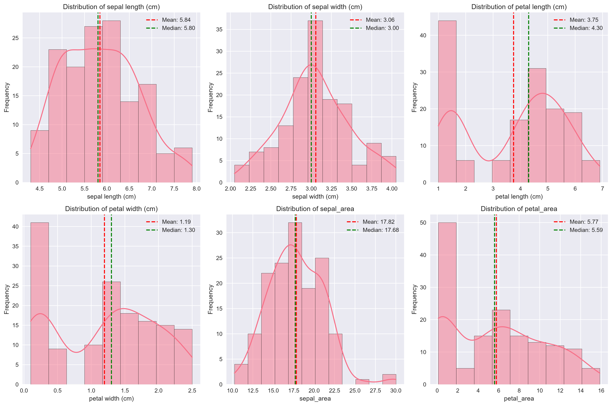
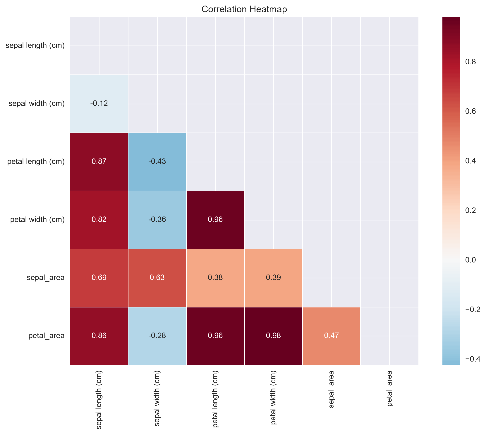
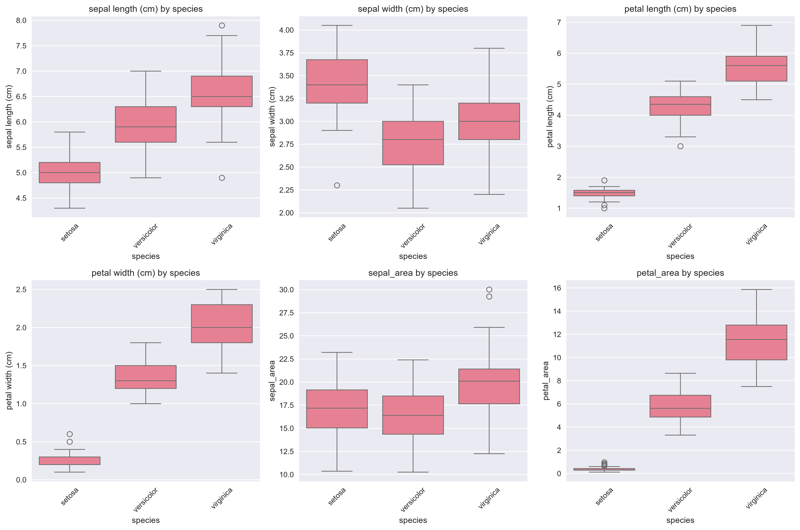

# Week 1 Report: Data Acquisition & Exploration

## Team: Statistics Superstars
**Date:** September 7, 2026

---

## 1. Dataset Overview

### Selected Dataset: Iris

**Source:** UCI Machine Learning Repository (https://archive.ics.uci.edu/dataset/53/iris), loaded via scikit-learn's built-in `load_iris()` function.

**Description:**
The Iris dataset contains measurements of 150 iris flowers from three species (setosa, versicolor, virginica). It includes four physical measurements (sepal length, sepal width, petal length, petal width) plus the species label. After cleaning, we added two derived columns (sepal_area and petal_area) and removed one duplicate row.

**Shape:** 149 rows x 7 columns

**Variables:**

| Variable | Type | Description | Missing (%) |
|----------|------|-------------|-------------|
| sepal length (cm) | numeric | Length of the sepal | 0% |
| sepal width (cm) | numeric | Width of the sepal | 0% |
| petal length (cm) | numeric | Length of the petal | 0% |
| petal width (cm) | numeric | Width of the petal | 0% |
| species | categorical | Flower species (setosa, versicolor, virginica) | 0% |
| sepal_area | numeric (derived) | sepal length x sepal width | 0% |
| petal_area | numeric (derived) | petal length x petal width | 0% |

---

## 2. Data Cleaning Summary

### Steps Performed:
1. **Missing Values**: No missing values were found in the raw dataset.
2. **Duplicates**: 1 duplicate row removed.
3. **Data Types**: Converted `species` to categorical type.
4. **Outliers**: 4 outliers detected and capped in `sepal width (cm)` to the range [2.05, 4.05].
5. **Derived Columns**: Added `sepal_area` and `petal_area` (length x width for each).

**See:** `reports/cleaning_log.txt` for detailed cleaning actions

---

## 3. Statistical Findings

### Key Summary Statistics:

| Variable | Mean | Median | Std | Skew | Kurtosis |
|----------|------|--------|-----|------|----------|
| sepal length (cm) | 5.84 | 5.80 | 0.83 | 0.31 | -0.57 |
| sepal width (cm) | 3.06 | 3.00 | 0.43 | 0.18 | -0.16 |
| petal length (cm) | 3.75 | 4.30 | 1.77 | -0.26 | -1.41 |
| petal width (cm) | 1.19 | 1.30 | 0.76 | -0.09 | -1.34 |
| sepal_area | 17.82 | 17.68 | 3.33 | 0.47 | 0.98 |
| petal_area | 5.77 | 5.59 | 4.72 | 0.28 | -1.14 |

### Normality Tests:

| Variable | Shapiro-Wilk p-value | Normal? |
|----------|---------------------|---------|
| sepal length (cm) | 0.0092 | No |
| sepal width (cm) | 0.0701 | Yes |
| petal length (cm) | 8.64e-10 | No |
| petal width (cm) | 1.85e-08 | No |
| sepal_area | 0.0138 | No |
| petal_area | 2.67e-08 | No |

### Strongest Correlations:

1. petal width (cm) <-> petal_area: 0.980 (Very strong positive)
2. petal length (cm) <-> petal width (cm): 0.963 (Very strong positive)
3. petal length (cm) <-> petal_area: 0.958 (Very strong positive)
4. sepal length (cm) <-> petal length (cm): 0.874 (Strong positive)
5. sepal length (cm) <-> petal_area: 0.860 (Strong positive)

---

## 4. Key Visualizations

### Figure 1: Distribution Plots

### Figure 2: Correlation Heatmap

### Figure 3: Box Plots

---

## 5. Initial Insights

1. **Key Finding 1**: [the three species have different ranges in measurements, particularly in the lengths and widths of the petals – setosa has smaller petals compared to versicolor and virginica, whereas the measurements of the sepals overlap among the three species. It indicates that petal measurements are more discriminating than sepal measurements.]
2. **Key Finding 2**: [The correlation between petal length, petal width and petal_area is very high (more than 0.95), but sepal measurements have low correlations with all the other variables. Hence, it can be inferred that petal attributes have a major role to play for any further classification or prediction.]
3. **Key Finding 3**: [Since almost none of the variables are normally distributed (only sepal width passed), Week 2 could focus on non-parametric hypothesis tests (like Mann-Whitney U or Kruskal-Wallis) to compare species, rather than tests that assume normality (like a standard t-test).]

---

## 6. Data Quality Issues

### Problems Identified:
- Only `sepal width (cm)` showed statistically normal distribution (p > 0.05); all other numeric variables were not normally distributed, meaning non-parametric tests may be more appropriate for Week 2 hypothesis testing.
- [Add any other issues your team noticed]

### Recommendations:
- Consider non-parametric statistical tests (e.g. Mann-Whitney U, Kruskal-Wallis) given the non-normal distributions.
- [Add other suggestions for Week 2]

---

## 7. Team Contributions

| Team Member | Tasks Completed | Hours |
|-------------|-----------------|-------|
| Student A (Nyi Min Satt) | GitHub setup, data cleaning, documentation | 6 |
| Student B (Lappawat Mahawong) | Statistical analysis, normality tests | 5 |
| Student C (ZONGTING LI) | Visualizations, interactive plots | 5 |

---

## 8. Next Steps (Week 2)

- [ ] Hypothesis testing
- [ ] Confidence intervals
- [ ] Distribution fitting
- [ ] Bootstrap methods

---

## Appendix

**Files Generated:**
- `data/processed/cleaned_data.csv`
- `reports/data_dictionary.csv`
- `reports/summary_statistics.csv`
- `reports/normality_tests.csv`
- `reports/cleaning_log.txt`
- `reports/figures/*.png`

**Notebooks:**
- `notebooks/00_initial_inspection.ipynb`
- `notebooks/01_data_cleaning.ipynb`
- `notebooks/02_statistical_summary.ipynb`
- `notebooks/03_exploratory_visualizations.ipynb`
