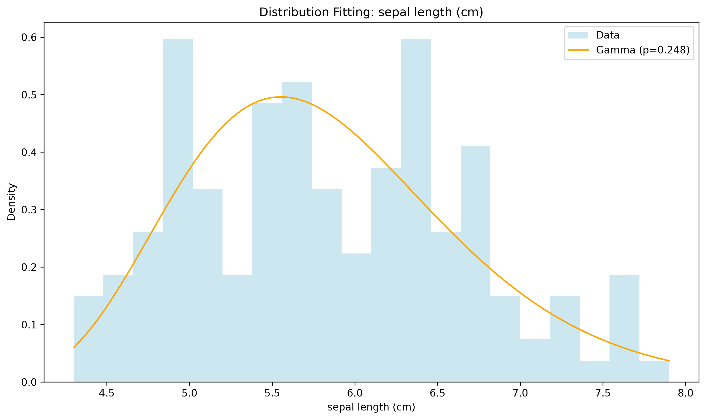
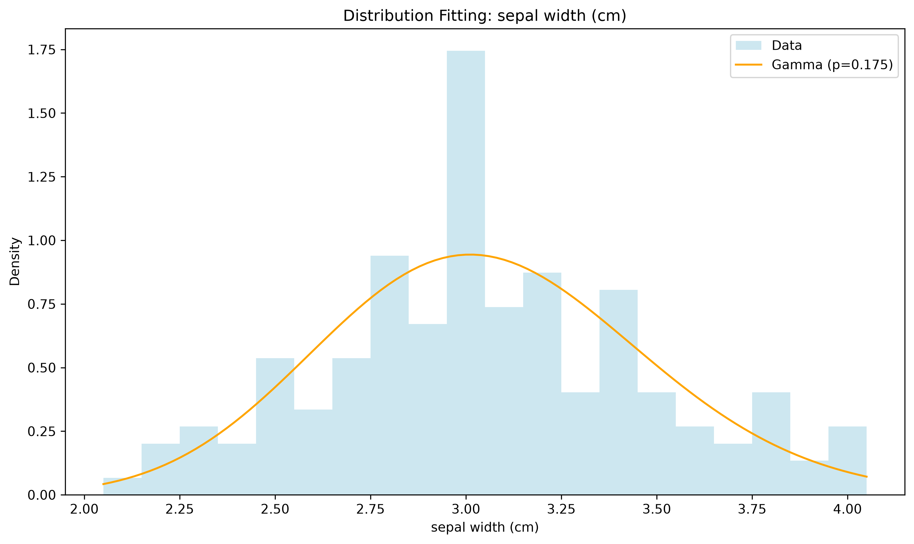
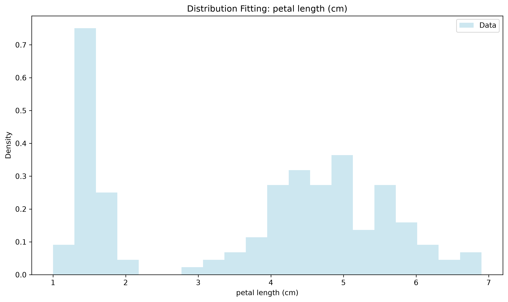
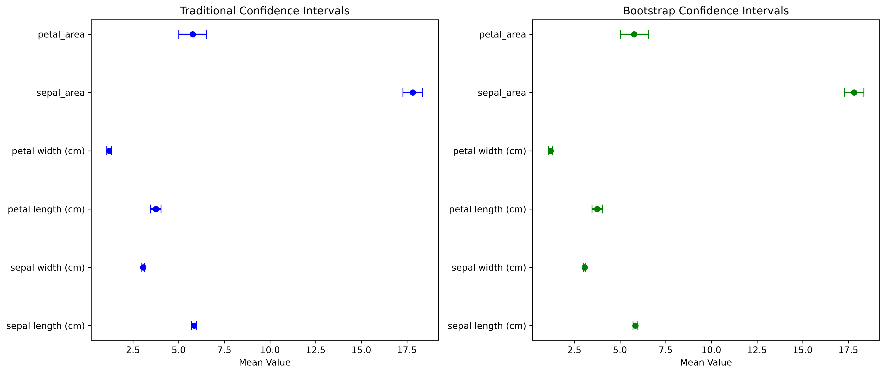

# Week 2 Report: Statistical Analysis

## Team: Statistics Superstars
**Date:** September 12, 2026

---

## 1. Hypothesis Testing Results

### 1.1 T-Tests

| Test | Variable 1 | Variable 2 | t-statistic | p-value | Significant |
|------|------------|------------|-------------|---------|-------------|
| One-sample | sepal length (cm) | 5.5 | 5.048 | 1.29e-06 | Yes |
| Independent | petal length (cm) | setosa vs versicolor | -39.493 | 5.40e-62 | Yes |

**Interpretation:**
- The one-sample t-test shows the average sepal length (5.84 cm) is significantly different from 5.5 cm.
- The independent t-test shows an extremely significant difference in petal length between setosa and versicolor -- setosa has much shorter petals.

### 1.2 ANOVA

| Variable | Groups | F-statistic | p-value | Significant |
|----------|--------|-------------|---------|-------------|
| petal length (cm) | species | 1176.84 | 8.96e-91 | Yes |

**Interpretation:**
- The ANOVA result confirms petal length differs significantly across all three species, with an extremely large F-statistic -- species is a very strong predictor of petal length.

### 1.3 Chi-Square Test

Skipped -- the Iris dataset only has one categorical variable (species), and chi-square requires two categorical variables to test independence between.

---

## 2. Distribution Fitting

### 2.1 Best-Fitting Distributions

| Column | Best Fit | p-value | Good Fit? |
|--------|----------|---------|-----------|
| sepal length (cm) | Gamma | 0.248 | Yes |
| sepal width (cm) | Gamma | 0.175 | Yes |
| petal length (cm) | Gamma | 1.41e-05 | No |
| petal width (cm) | Gamma | 0.0002 | No |
| sepal_area | Gamma | 0.910 | Yes |
| petal_area | Gamma | 7.34e-06 | No |

### 2.2 Distribution Visualizations

**Interpretation:**
- Sepal measurements and sepal_area fit a Gamma distribution well, while petal measurements and petal_area do not fit any of the tested distributions well.
- This lines up with the strong species separation we saw in petal measurements -- since petals differ so much between species, the combined data doesn't follow one smooth distribution shape.

---

## 3. Confidence Intervals

### 3.1 Traditional Confidence Intervals (95%)

| Column | Mean | CI Lower | CI Upper | Width |
|--------|------|----------|----------|-------|
| sepal length (cm) | 5.844 | 5.710 | 5.977 | 0.267 |
| sepal width (cm) | 3.056 | 2.988 | 3.125 | 0.137 |
| petal length (cm) | 3.749 | 3.465 | 4.033 | 0.568 |
| petal width (cm) | 1.195 | 1.072 | 1.317 | 0.245 |
| sepal_area | 17.818 | 17.284 | 18.353 | 1.069 |
| petal_area | 5.768 | 5.010 | 6.525 | 1.515 |

### 3.2 Bootstrap Confidence Intervals (95%)

| Column | Mean | CI Lower | CI Upper | Width |
|--------|------|----------|----------|-------|
| sepal length (cm) | 5.844 | 5.709 | 5.978 | 0.269 |
| sepal width (cm) | 3.056 | 2.988 | 3.123 | 0.136 |
| petal length (cm) | 3.749 | 3.464 | 4.030 | 0.566 |
| petal width (cm) | 1.195 | 1.072 | 1.317 | 0.246 |
| sepal_area | 17.818 | 17.285 | 18.351 | 1.065 |
| petal_area | 5.768 | 5.010 | 6.546 | 1.536 |

**Comparison:**
- Traditional and bootstrap confidence intervals are nearly identical across all variables, with widths differing by less than 0.02 in every case.
- This suggests the traditional method is reliable here, likely because our sample size (149) is large enough for the Central Limit Theorem to apply even though some variables aren't individually normal.

---

## 4. Key Statistical Findings

1. **Normality**: 3 of 6 variables (sepal length, sepal width, sepal_area) fit a Gamma distribution well; petal length, petal width, and petal_area did not fit any tested distribution well.
2. **Significant Differences**: Found highly significant differences in petal length between species, both via t-test (setosa vs versicolor) and ANOVA (all three species).
3. **Distribution**: Gamma was the best-fitting distribution tested across all variables, though it only fit well for sepal-related measurements.
4. **Confidence**: We are 95% confident the true mean petal length lies between 3.47 cm and 4.03 cm, and traditional/bootstrap methods agree closely across all variables.

---

## 5. Interpretation & Conclusions

### 5.1 What the Results Mean
- This proves that there is significant variance in the physical characteristics among the different Iris species, especially the length of the petals. The statistical tests prove that these differences are highly unlikely to be due to mere coincidence.
- Petals have greater discriminative power compared to sepals when used to classify iris flowers due to their clear separation into different species.

### 5.2 Limitations
- Sample size is relatively small (149 rows) and limited to one botanical dataset -- findings may not generalize beyond Iris flowers.
- However, some assumptions were not completely met, such as the assumption of normality on the distribution of the variables petal_length, petal_width, and petal_area.
- A further weakness in this experiment is that the analysis relies on data from only three species of Iris, making the outcomes specific only to this group of flowers.

### 5.3 Recommendations for Week 3
- Prioritize visualizing petal measurements by species, since these showed the strongest statistical separation.
- The dashboard will have interactive scatter plots and box plots, as well as filters based on the species for comparison of petal and sepal dimensions.
- Further investigation could include finding associations among the variables and examining the possibility of predicting the species of the Iris using classification techniques based on the given attributes.

---

## 6. Team Contributions

| Team Member | Tasks Completed | Hours |
|-------------|-----------------|-------|
| Student A (Nyi Min Satt) | Data prep, environment management, documentation | 3 |
| Student B (Lappawat Mahawong) | All statistical tests & analysis (hypothesis testing, distribution fitting, confidence intervals) | 8 |
| Student C (ZONGTING LI) | Visualization support | 3 |

---

## Appendix

**Files Generated:**
- `reports/hypothesis_tests_summary.csv`
- `reports/distribution_fitting_summary.csv`
- `reports/ci_comparison.csv`
- `reports/figures/distribution_fit_*.png`
- `reports/figures/confidence_intervals_comparison.png`

**Notebooks:**
- `notebooks/02_hypothesis_testing.ipynb`
- `notebooks/03_distribution_fitting.ipynb`
- `notebooks/04_confidence_intervals.ipynb`
